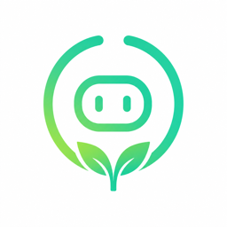

<p align="center">
  
</p>

<h1 align="center">OpenAGI</h1>

<p align="center"><strong>A self-improving, proactive agent.</strong></p>
<p align="center"><em>It learns. It reaches out. It earns its keep.</em></p>

> Most agents sit there and wait for a prompt. OpenAGI runs as a daemon on your machine, picks up on the things you do over and over, and pings you with what it can take off your plate.

**Website:** [openagi.sh](https://openagi.sh) · **Install:** `curl -fsSL openagi.sh | sh` · **Source:** [github.com/Spshulem/openAGI](https://github.com/Spshulem/openAGI)

```text
[Mon · 7:42 am]
↗ I noticed a morning routine.
  For the past 5 weekdays you:
    · check #incidents in Slack
    · pull yesterday's deploys from GitHub
    · draft a standup note
  I can run this every morning at 7:30 am and have it waiting.
  → approved · saved as /morning-standup

[Mon · 2:31 pm]
↗ Prep for your 3 pm with Acme Corp.
  4 tickets in last 30 days about CSV export limits.
  Mentioned competitor "Vellum" last call.
  Renewal in 6 weeks — expansion potential.
  Brief drafted. Want me to open it?
```

That's the difference. OpenClaw, AutoGPT, even cloud agents like Claude.ai and Devin sit dormant until you type something. OpenAGI is **proactive** — it runs as a daemon, reads your activity, and surfaces things on its own. The first hour you have it installed, it's already noticing patterns. The first week, it's drafting skills. By month two it's doing the boring half of your work without being asked.

Everything lives under `~/.openagi/` on your machine. No accounts. No telemetry. No cloud component. Bring your own LLM (OpenAI, Anthropic, Ollama).

---

## The three innovations

Stronger reasoning and prediction alone aren't going to produce AGI. A system that can perform emergent tasks and interact with the world without intervention needs three things working together. OpenAGI is built around them.

> The full thinking is in **[WHITEPAPER.md](WHITEPAPER.md)** — a personal essay on why these three, why now, and how they map to the code. If you want the marketing-friendly version, keep scrolling. If you want the manifesto, read that.

### 1. Directional Adaptive Scrutiny — `src/directional-adaptive-scrutiny.js`

A scrutinizer with **direction but no fixed outcome**, predictable in its logic, diverse in what it can evaluate, and capable of polarized verdicts. Today's reinforcement learning is monolithic — one objective, one right answer. Real environments are *cyclical, diverse, and extreme,* and that's what produces emergent intelligence. OpenAGI scores every incoming signal on seven axes (`urgency / impact / novelty / repetition / risk / confidence / specificity`) and decides one of five things: `act`, `ask`, `watch`, `ignore`, `propagate`. That decision drives everything downstream.

### 2. Tiered Memory — `src/memory-system.js`

Short-term (RAM — what you need right now), medium-term (day-to-day), long-term **Lava** (durable truths reasoned from feeling, not logic). Memory decays. Repeated raw items get condensed into principles. Compression isn't a performance optimization — it's evolutionary pressure. Perfect memory is a curse, not a gift; a system that can't forget can't progress. Most LLMs only have RAM and long-term storage with nothing managing what flows where. OpenAGI manages it: durable JSONL+snapshot stores for each tier, a condenser that promotes/demotes, and a recall layer that reasons about *fidelity*, not just hits.

### 3. Propagation — `src/propagation-controller.js`

Specialization through **division, not multiplication.** When a task becomes repetitive *or* novel-but-high-risk, the system spawns a bounded specialist with its own scope, memory, and tools — and the main system goes on autopilot for that lane. Multiplying the agent 1:1 is cancerous (creates complexity without value); dividing creates depth without sprawl. Specialists that don't earn their keep get retired by the daily quality sweep. Whether you look at synapses, hierarchies, or companies, the goal is the same: specialize repetitive tasks, recover the cycles for the things that matter.

---

## What this looks like to you

The three innovations above are the engine. The user-visible behavior that falls out of them:

- **Proactive.** The agent runs in the background, watches your activity (opt-in), and reaches out — "I noticed a routine," "Heads up," "I drafted a skill." It starts the conversation. Other local agents wait for prompts.
- **Persistent.** Conversations, corrections, and decisions stick across sessions. Corrections you make once never have to be made twice.
- **Specialized over time.** As your patterns become clear, OpenAGI propagates specialists — by month three, the boring half of your work is being handled by sub-agents that aren't asking you for input.
- **Local + private.** Everything lives under `~/.openagi/`. No accounts, no telemetry, no cloud component. Bring your own LLM (OpenAI, Anthropic, anything that speaks the OpenAI Responses API).

---

## How OpenAGI compares

The highlighted rows are the bet — Scrutiny, tiered Memory, and Propagation, plus the proactive behavior they enable. Everything below the line is plumbing every local agent has by now.

|                                            | OpenAGI | OpenClaw | AutoGPT | Operator | Claude.ai | Devin |
|--------------------------------------------|:-------:|:--------:|:-------:|:--------:|:---------:|:-----:|
|                                            | _local_ | _local_  | _local_ | _cloud_  |  _cloud_  | _cloud_ |
| **Directional Adaptive Scrutiny**           | **✅**  |    —     |    —    |    —     |     —     |   —   |
| **Tiered Memory (short / medium / Lava)**   | **✅**  |    —     |    —    |    —     |     —     |   —   |
| **Propagation — bounded specialists**       | **✅**  |    —     |    —    |    —     |     —     |   —   |
| **Reaches out to you (proactive)**          | **✅**  |    —     |    —    |    —     |     —     |   —   |
| **Watches your work, learns patterns**      | **✅**  |    —     |    —    |    —     |     —     |   —   |
| **Auto-drafts skills from observed routines** | **✅**  |    —     |    —    |    —     |     —     |   —   |
| Runs on your machine                        |   ✅    |    ✅    |    ✅   |    —     |     —     |   —   |
| Your data never leaves                      |   ✅    |    ✅    | partial |    —     |     —     |   —   |
| Bring your own LLM                          | ✅ any  |    ✅    |    ✅   |    —     |     —     |   —   |
| Persistent memory across sessions           | ✅ tiered | ✅ md   |    —    | limited  | limited   | limited |
| Multi-channel (SMS / Telegram / HTTP)       |   ✅    |    ✅    |    —    |    —     |     —     |   —   |
| MCP server support                          |   ✅    |    ✅    |    —    |  some    |    —      |   —   |
| Source-available                            |   ✅    |    ✅    |    ✅   |    —     |     —     |   —   |
| No telemetry, no accounts                   |   ✅    |    ✅    |    ✅   |    —     |     —     |   —   |

OpenClaw and PicoClaw nailed the local-first daemon shape — durable memory, MCP registry, channels. But they're still answer-machines: you have to drive them. Cloud agents (Operator, Claude.ai, Devin) sit dormant too. The hard problem in agents isn't running locally; it's **a system that scrutinizes signals, manages memory at three fidelities, and specializes through division.** Once those three loops are running, *reaching out first* isn't a feature you bolt on — it's what falls out.

If you want the long form on why these three (and not, say, "more parameters") get you closer to AGI, read **[WHITEPAPER.md](WHITEPAPER.md)**.

---

## Get started

One command. Then leave it running. The proactive part needs time to watch.

**Linux / Raspberry Pi / SBC:**
```bash
curl -fsSL openagi.sh | sh
```

**macOS / from source:**
```bash
git clone https://github.com/Spshulem/openAGI && cd openAGI && npm install && npm run serve
```

**Docker:**
```bash
docker run -d --name openagi -p 43210:43210 -v openagi-data:/data ghcr.io/spshulem/openagi:latest
```

Open `http://127.0.0.1:43210/`. Drop in an OpenAI or Anthropic key in the wizard (or skip and run in deterministic mode while you poke around). That's all the setup — there's nothing else to configure to get the proactive value flowing.

### What happens next, with no further input from you

| When | What you'll see |
|------|-----------------|
| Right away | Chat UI, MCP tab, Skills tab, Memory tab, Activity tab. Tools like `remember`, `recall`, `schedule_message` already work. |
| After 1 chat | The agent remembers. Ask it later "what did we decide about X" — it knows. |
| First night _(03:30 UTC)_ | **Session miner** runs across your chat history, clusters recurring intents, drafts skills you might want, drops them in the Suggested tab. |
| First night _(02:30 UTC)_ | If you've enabled Mac screen capture, the **pattern miner** runs across your activity, finds repeating app sequences (e.g. "Slack → GitHub → Notion every 9am"), drafts a skill, surfaces it. |
| Each Mac notification | "OpenAGI learned a new skill" — click to review, accept with one click, and it's saved as a real `SKILL.md` the agent can run. |
| Ongoing | Schedule a prompt with `schedule_message` and OpenAGI texts/Telegrams you when it fires. |

The whole point is you don't sit there typing prompts. You install it, you go back to work, and it tells you what's worth doing.

---

## Install

All install paths end with a daemon listening on `127.0.0.1:43210` and a setup wizard at `/setup`.

### Linux (one-line installer)

```bash
curl -fsSL https://raw.githubusercontent.com/Spshulem/openAGI/main/scripts/install.sh | sh
```

Auto-detects Docker vs. native systemd, installs Node if missing, sets up the service, prints the wizard URL.

### macOS / Linux (from source)

```bash
git clone https://github.com/Spshulem/openAGI && cd openAGI
npm install
npm run serve                # http://127.0.0.1:43210/setup
```

For always-on:

```bash
npm run install-launchd      # macOS — auto-start at login + auto-restart on crash
npm run install-systemd      # Linux — same, via systemd (sudo for system-wide; pass 'user' for rootless)
```

### macOS native menu bar app

A SwiftUI menubar app that bundles Node + the runtime + Sparkle auto-update + screen capture + replay confirmation:

```bash
./scripts/build-mac-app.sh                            # unsigned local build
SIGN_IDENTITY="Developer ID Application: ..." \
  NOTARIZE=1 DMG=1 \
  AC_USERNAME=... AC_PASSWORD=... AC_TEAM_ID=... \
  ./scripts/build-mac-app.sh                          # signed, notarized .dmg
```

Output: `build/OpenAGI.app` (+ optional `.dmg`). See [`mac/README.md`](mac/README.md) for Sparkle key setup, hardened-runtime entitlements, and release signing.

### Docker / Linux SBC (Raspberry Pi, Jetson, x86)

```bash
docker run -d --name openagi \
  -p 43210:43210 -v openagi-data:/data \
  ghcr.io/spshulem/openagi:latest
```

Multi-arch image (`linux/amd64` + `linux/arm64`). Or with compose:

```bash
cp .env.example .env
docker compose -f docker-compose.example.yml up -d
```

### Updates

```bash
npm run update                 # auto-detects mode (docker/systemd/launchd/source) and updates in place
npm run install-update-timer   # Linux: install a weekly auto-update timer (Sundays 04:00)
```

For Docker, run [Watchtower](https://containrrr.dev/watchtower/) alongside the OpenAGI container. The Mac native `.app` updates via Sparkle automatically.

---

## What's wired

| Capability | Detail |
|------------|--------|
| **Chat UI** | `/` — sessions sidebar, message thread, tabs for Memory / Cron / Skills / MCP / Agents / Channels / Activity. SSE event stream so the UI updates live. |
| **Tool-use loop** | When `OPENAI_API_KEY` or `ANTHROPIC_API_KEY` is set, the agent uses tool calling with structured args. Default model: `gpt-5`. |
| **Internal tools** | `remember`, `recall`, `schedule_message`, `list_sessions`, `list_skills`, `run_skill`, `list_mcp_tools`, `run_mcp_tool`, `register_mcp_server`, `connect_mcp_server`, `disconnect_mcp_server`, `list_cron_jobs`, `cancel_cron_job`, `get_audit`, `get_budget`, `set_provider`, `retire_specialist`, `replay_skill`. |
| **Skills** | Drop a `SKILL.md` (frontmatter + body) under `.openagi/skills/<name>/` — it shows up as a first-class tool the agent can invoke. |
| **Auto-skill mining** | Pattern-miner runs nightly, detects repeating activity sequences, LLM proposes a skill, lands in `.openagi/skills-suggested/` for one-click accept. Session-miner does the same on chat history. |
| **Skill replay** | Action vocabulary (`open_app`, `keyboard_shortcut`, `applescript`, `shortcut`, `type`, `wait`, `say`, `browser`, ...) — Mac executor confirms first run with a modal, persists trust. |
| **MCP execution** | Register stdio or HTTP+OAuth MCP servers in `.openagi/mcp.json` (or via the UI). On connect, every tool the server advertises becomes a callable agent tool (`mcp_<server>_<tool>`). |
| **Cron prompts** | The agent can call `schedule_message({prompt, delaySeconds | intervalSeconds | dailyAt, channel, target})`. When the job fires, the daemon runs the prompt and routes the reply to the originating channel (SMS, Telegram, local). |
| **SMS bidirectional** | Twilio inbound webhook → agent reply via TwiML. Twilio outbound REST for proactive sends and scheduled fires. |
| **Telegram** | Webhook (`/channels/telegram/webhook`) or long polling (`TELEGRAM_POLLING=1`). |
| **Persistent state** | All under `.openagi/`: memory (JSONL audit + atomic snapshot), cron jobs, agent/session store, specialist workspaces, MCP logs. |

---

## Remote access (SMS, Telegram, tunneling)

Once the daemon is running locally, you can reach it from anywhere via SMS or Telegram by pairing it with a public tunnel.

> Full step-by-step including tunnel + auth + Telegram + launchd: [`docs/setup/remote-channels.md`](docs/setup/remote-channels.md). Quick version below.

### Tunnel

```bash
npm run tunnel    # cloudflared (preferred) or ngrok, auto-detected
```

### Twilio bidirectional SMS

1. Drop credentials into `.openagi/.env`:
    ```bash
    TWILIO_ACCOUNT_SID=AC...
    TWILIO_AUTH_TOKEN=...
    TWILIO_FROM_NUMBER=+15551234567
    ```
2. Tunnel a public URL: `ngrok http 43210` → copy `https://abcd1234.ngrok-free.app`.
3. In the Twilio console for your number, set the **A MESSAGE COMES IN** webhook to:
    ```
    https://abcd1234.ngrok-free.app/channels/twilio/webhook
    ```
4. Text your number. The reply comes back as TwiML.
5. Schedule an SMS ping:
    ```bash
    curl -s http://127.0.0.1:43210/cron \
      -H "authorization: Bearer $OPENAGI_AUTH_TOKEN" \
      -H 'content-type: application/json' \
      -d '{"name":"morning-nudge","prompt":"One-line motivational sentence.","dailyAt":"08:00","channel":"sms","target":"+15555550123"}'
    ```

### Telegram

Create a bot via [@BotFather](https://t.me/BotFather), drop the token in `.openagi/.env`:

```bash
TELEGRAM_BOT_TOKEN=...
TELEGRAM_POLLING=1               # or set up a webhook to /channels/telegram/webhook
TELEGRAM_WEBHOOK_SECRET=...      # only if using webhooks
```

---

## Screen capture & pattern mining (macOS)

Off by default. To enable on the macOS native app:

1. Launch `OpenAGI.app`.
2. Click the menu-bar icon → **Capture** → **Enable capture**.
3. macOS prompts for **Screen Recording** + **Accessibility** permissions — grant once.
4. Click **Capture → Privacy settings…** to tune frequency, retention, app/regex exclusions, and disk budget.

Once running:
- Every ~30 seconds the Mac batches activity (window titles + frame OCR) and pushes to the daemon's `/observations` endpoint.
- Nightly at 02:30 UTC, the **pattern miner** clusters repeating sequences and asks the LLM to propose a skill name + description + body.
- Suggested skills land in `.openagi/skills-suggested/` and surface in the dashboard's **Skills → Suggested** section.
- Accept → writes a real `SKILL.md`. If the skill includes a `replay:` block, `replay_skill` invokes it (Mac shows a confirmation modal first run).

Privacy posture (non-negotiable):
- No keystroke logging
- No cloud sync — capture stays local
- Default-deny exclusion list: 1Password, Wallet, banking sites, private/incognito windows, 2FA / OTP screens
- One-click wipe in the privacy panel

---

## MCP servers

Drop a config at `.openagi/mcp.json`:

```json
{
  "servers": {
    "filesystem": {
      "command": "npx",
      "args": ["-y", "@modelcontextprotocol/server-filesystem", "/tmp"],
      "trustLevel": "trusted"
    },
    "my-hosted": {
      "url": "https://mcp.example.com/mcp",
      "auth": "oauth",
      "trustLevel": "trusted"
    }
  }
}
```

Three transport+auth shapes are supported: **stdio** (spawn local process), **http+bearer** (URL with static API key), **http+oauth** (URL with browser-based OAuth — supports both dynamic registration and pre-registered clients).

For the bearer shape, reference your secrets via `.openagi/.env` only — `${VAR}` substitution is allowlisted to keys defined in that file (closes the env-var exfiltration class). Restart the daemon and click **Connect** in the MCP tab — or:

```bash
curl -s -X POST http://127.0.0.1:43210/mcp/connect/filesystem \
  -H "authorization: Bearer $OPENAGI_AUTH_TOKEN"
```

On connect, each MCP tool becomes a first-class agent tool (`mcp_filesystem_read_file`, etc.) and the model can call it directly.

---

## Skills

Skills are markdown templates the agent can run as sub-prompts. Three are bundled (`recap`, `morning-brief`, `remind`). Add your own at `.openagi/skills/<name>/SKILL.md`:

```markdown
---
name: weekly-review
description: Summarize the past 7 days of memory and propose 3 follow-ups.
replay:
  - say: "Running your weekly review."
  - applescript: |
      tell application "Calendar" to activate
---

You are running a weekly review.

1. Call `recall` with query "this week" to pull recent items.
2. Group by tag, summarize each cluster in one bullet.
3. Propose three follow-ups the user should schedule.

User asked: {{input}}
```

The skill becomes the `skill_weekly_review` tool and is also runnable from the UI's **Skills** tab. The `replay:` block (optional) makes it executable on the Mac via `replay_skill` with a confirmation modal.

---

## Integrations

Integrations are plug-in modules in `src/integrations/<name>.js`. Each one self-registers tools when its credentials are present in env, and silently no-ops otherwise. **No keys live in source.**

Bundled:

| Integration | Env | Tools | Use |
|---|---|---|---|
| Rize.io (time tracking) | `RIZE_API_KEY` | `rize_query`, `rize_today_summary`, `rize_recent_sessions` | "What did I work on today?" |

To add another (e.g. Toggl, Linear, GitHub via API), copy `src/integrations/rize.js` as a template:

```js
export function registerYourIntegration(runtime, options = {}) {
  const client = options.client ?? new YourClient(options);
  if (!client.isConfigured()) return { registered: false, reason: "API key not set" };
  runtime.tools.register({ name: "your_tool", parameters: {...}, handler: async (args) => client.something(args) });
  return { registered: true };
}
```

Then add one line to `src/abi-runtime.js`: `registerYourIntegration(this);`

For SaaS that ships an MCP server, you don't need an integration module — just point `.openagi/mcp.json` at it and the agent gets every tool automatically.

---

## Auth & security

When `OPENAGI_AUTH_TOKEN` is unset, the dashboard runs unauthenticated (fine for `127.0.0.1` only). When set, every route except `/health` and the webhook endpoints requires:

- header `Authorization: Bearer <token>`, or
- a `?token=<token>` query (browser convenience — sets a cookie, then redirects), or
- the `openagi_token` cookie.

Generate a strong token:

```bash
node -e "console.log(require('node:crypto').randomBytes(32).toString('base64url'))"
```

Webhooks self-validate instead:

- **Twilio:** when `TWILIO_AUTH_TOKEN` and `OPENAGI_PUBLIC_URL` are set, the daemon verifies the `X-Twilio-Signature` HMAC against the incoming form body.
- **Telegram:** set `TELEGRAM_WEBHOOK_SECRET` and pass the same value as `secret_token` to `setWebhook` — the daemon checks the `X-Telegram-Bot-Api-Secret-Token` header.

Additional defenses:

- **Cross-origin POST blocked** — any browser request whose `Origin` doesn't match `Host` is rejected with 403, regardless of auth state.
- **MCP register hardening** — `command` is allowlisted to known runners (`npx`, `node`, `bun`, `deno`, `python3`, `uvx`, `docker`); URL hosts may not be loopback / RFC1918 / link-local / cloud-metadata; `${VAR}` substitution is allowlisted to keys explicitly declared in `.openagi/.env`.

---

## Endpoints

| Method | Path                              | Notes                                  |
| ------ | --------------------------------- | -------------------------------------- |
| GET    | `/`                               | Chat UI                                |
| GET    | `/health`                         | Runtime status                         |
| GET    | `/events`                         | SSE event stream                       |
| POST   | `/message`                        | Local channel message                  |
| GET    | `/sessions`, `/sessions/:id`      | Conversation transcripts               |
| GET    | `/memory`                         | Tiered memory snapshot                 |
| POST   | `/cron`                           | Create a job                           |
| DELETE | `/cron/:id`                       | Remove a job                           |
| POST   | `/cron/:id/run`                   | Run a job now                          |
| GET    | `/skills`                         | List skills                            |
| POST   | `/skills/reload`                  | Re-scan skill directories              |
| POST   | `/skills/:name/run`               | Run a skill                            |
| POST   | `/skills/replay/:name`            | Replay a skill on the Mac              |
| GET    | `/mcp`, `/mcp/tools`              | MCP server + tool inventory            |
| POST   | `/mcp/register`                   | Register a server at runtime           |
| POST   | `/mcp/connect/:name`              | Spawn the server, fetch tools          |
| POST   | `/mcp/disconnect/:name`           | Kill it                                |
| POST   | `/mcp/call`                       | `{server, tool, args}`                 |
| POST   | `/observations`                   | Activity batch from Mac capture        |
| GET    | `/observations/search`            | Full-text search of observed activity  |
| POST   | `/channels/twilio/webhook`        | Twilio inbound SMS                     |
| POST   | `/channels/telegram/webhook`      | Telegram inbound                       |
| POST   | `/channels/sms/send`              | Twilio outbound (`{to, text}`)         |
| POST   | `/tick`                           | Manually run due cron jobs             |

---

## Environment

See `.env.example`. All keys read from `.env` and `.openagi/.env`.

## Tests

```bash
npm test
```

## Project layout

```
src/
  abi-runtime.js              orchestrates signals → scrutiny → memory → propagation
  agent-host.js               turn loop, threads tool registry into model provider
  agent-store.js              persistent agents and sessions
  auth.js                     bearer/cookie auth + CSRF (cross-origin POST guard)
  channels.js                 local + Telegram + Twilio (SMS) channels
  cron-scheduler.js           interval/dailyAt jobs (incl. the "prompt" job type)
  directional-adaptive-scrutiny.js  decision layer
  hosted-interface.js         HTTP server, SSE, chat UI
  mcp-client.js               stdio JSON-RPC MCP transport
  mcp-http-client.js          HTTP+bearer MCP transport
  mcp-oauth.js                HTTP+OAuth MCP transport (DCR + pre-registered)
  mcp-registry.js             config + live clients, tool exposure
  memory-system.js            short/medium/long tiers with decay
  model-provider.js           DeterministicModelProvider + OpenAI / Anthropic tool loops
  observation-store.js        SQLite FTS5 store for capture observations
  pattern-miner.js            cluster repeating activity → propose skills
  session-miner.js            cluster repeating chat intents → propose skills
  propagation-controller.js   bounded specialist creation
  skills.js                   SKILL.md loader, exposes each skill as a tool
  skill-replay.js             replay parser + executor + trust persistence
  tool-registry.js            internal tools the agent can call
mac/Sources/OpenAGI/
  AppDelegate.swift           menubar lifecycle
  TrayController.swift        menu bar icon + status
  DaemonController.swift      Node bundle launcher + crash recovery
  AppState.swift              SSE client + dashboard window
  Capture/                    ScreenCaptureKit + Vision OCR pipeline
  Replay/                     SSE-driven action executor + confirmation modal
examples/
  hosted-server.js            entrypoint for `npm run serve`
  abi-demo.js                 deterministic ABI signal demo
  skills/                     bundled starter skills
test/
  abi-runtime.test.js
```

---

## Roadmap

- HTTP / SSE MCP transport for a richer client capability than current stdio.
- Specialist routing — when a message matches a specialist's bounded scope, route to it instead of always `main`.
- Embeddings-backed memory search alongside the current keyword overlap.
- Per-channel delivery policies and retry queues.
- Sparkle release pipeline so the Mac `.app` updates automatically.

---

## License

**PolyForm Noncommercial License 1.0.0** — see [LICENSE](LICENSE).

You can use, fork, run, and modify OpenAGI freely for personal, research, hobby, educational, government, and other noncommercial purposes. Commercial use (including using OpenAGI as part of a paid product or revenue-generating service) requires a separate license — open an issue or reach out if you want one.

---

[openagi.sh](https://openagi.sh) · [Issues](https://github.com/Spshulem/openAGI/issues) · [Docs](https://github.com/Spshulem/openAGI/tree/main/docs)
